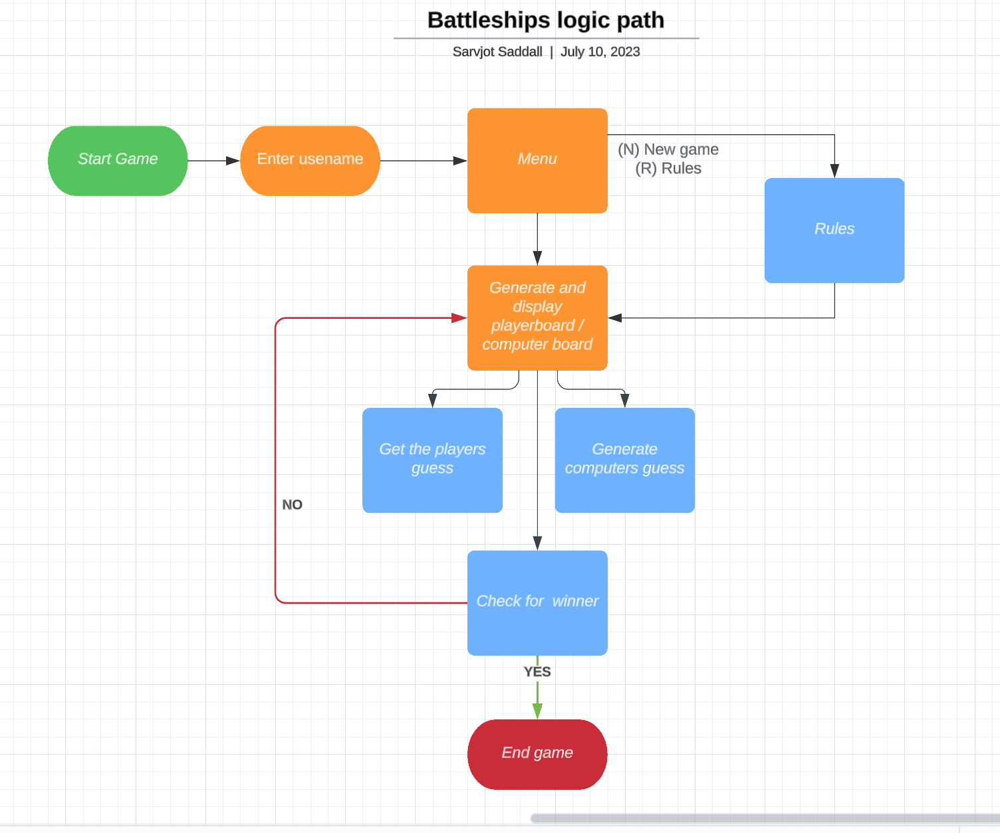

# BATTLESHIPS

## Introduction

Welcome to my take on the traditional battleships game, which runs in the Code Institute mock terminal on Heroku.

The user can play against the computer and the first to destroy all of their opponents battleships wins the game.

https://projectp3-battleships-a9dbd7a9cae9.herokuapp.com/

## How to play

In this version the player will first have to enter a username which will then take them to the main menu.

Within the main menu the player can choose two options, option 1 to start the game and option 2 to check the rules.

The player can see where their ships have been placed which are indicated by the "S" symbol, however they cannot see the computers ships. The computers grid does appear but all of their ships remain hidden.

Guesses are marked on the boards with an "_" and the hits are marked with an "X".

The player and computer takes turn in making a guess to try and sink their opponents ships. Both the players board and the computers board are updated after one turn each.

The first to sink all of their opponents ships, wins the game.

## Planning

I used Lucidchart.com to create my flowchart for my Battleships logic path.

## Features

### Existing features

- Username must be entered.

- Main Menu:

1. Option 1 starts the game.
1. Option 2 shows the player the rules.

- Random boards generated for player & computer.

- Computers ships are hidden from the user.

- Play against the computer.

- Accepts players input.

- Input validation and error checking:

1. Player cannot enter the same coordinates twice.
1. The input must be numbers.
1. You cannot enter coordinates outside the grid set.

### Future features

- Maintain scores

- Allows the player to choose the gird size and numbers of ships.

- Allows the user to add ships to their own board.

## Technologies Used

- Python
- Github
- Heroku
- LucidCharts

## Testing

I have manually tested this project by doing the following:

- Passed the code through a PEP8 linter and confirmed there are no problems.
- Tested in my local code terminal and the Code Institute Heroku terminal.
- Input invalid strings and numbers to check if the appropriate message is displayed.

### Bugs fixed

- https://github.com/Savy92/pp3_battleships/issues/1#issue-1806310179

- https://github.com/Savy92/pp3_battleships/issues/2#issue-1806310777

### Bugs remaining

- No bugs remaining.

### Validator testing

- No errors were returned from PEP8online.com

## Deployment

This project was deployed using Code Institute's mock terminal for Heroku.

- Steps for deployment:

1. Fork or clone this repository.
1. Create a new Heroku app.
1. Set the buildbacks to Python & NodeJS in that order.
1. Link the Heroku app to the repository.
1. Click on deploy.

## Credits

- Code Institute for the deployment terminal.

- Wikipedia for the details of the Battleship game.
